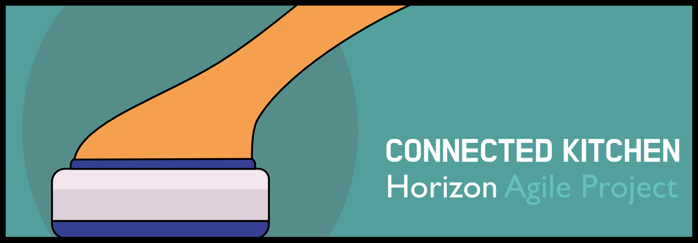

# The connected kitchen project

This code was written for a year-long agile Horizon project, exploring the potential of remotely monitoring kitchen hygiene practices. The code consists of a couple of dashboards, the <strong>live</strong> dashboard that connects (using the Web Bluetooth API) to our devices to read and display live data as participants undertake a cleaning task, and the <strong>longitudinal</strong> dashboard that compares a user's aggregate data against previous participants. 

## The live dashboard
The live dashboard uses react and d3 to visualise data from three bits of hardware: a smart sponge (a dishmatic sponge with an <a href="http://adafru.it/4516">Adafruit Bluefruit Sense Feather</a>, some bluetooth enabled weighing scales and a water flow monitor.

## The longitudinal dashboard
The longitundinal dashboard presents aggregate data against participants' average.  All data is stored in-browser (I do all I can not to rely on any backends if I can..)  
